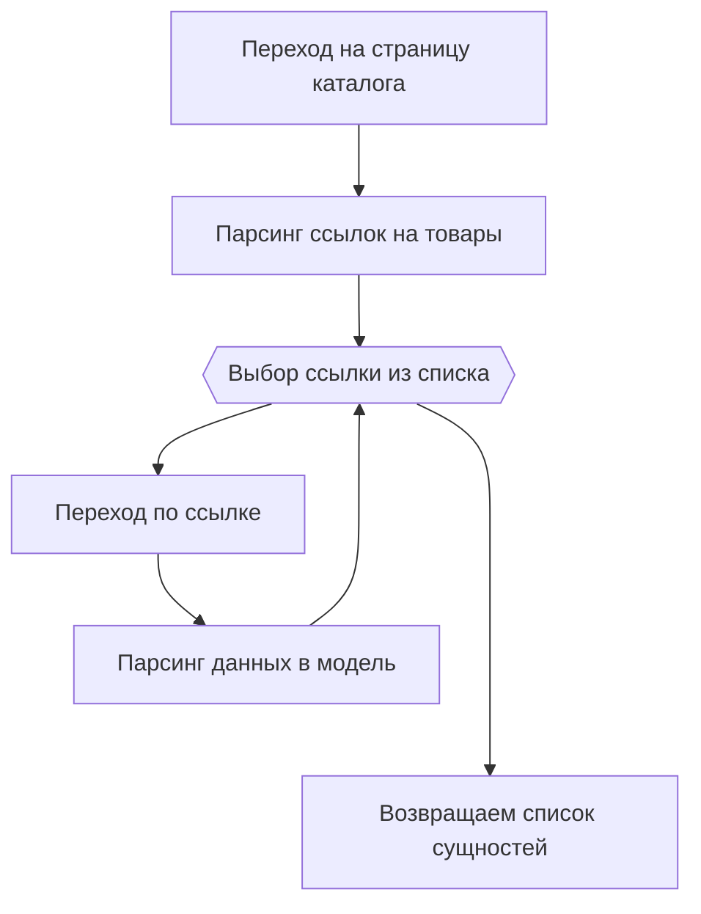
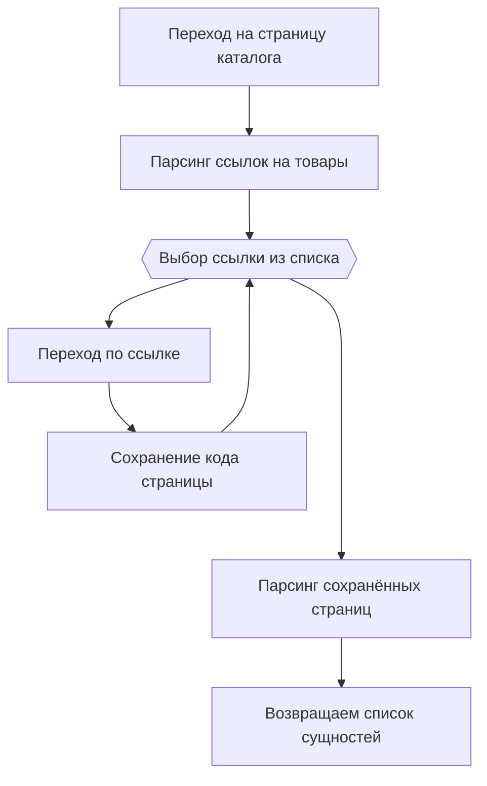

# AOIS Lab 6 Selenium
Проект консольного приложения на .NET Core 6.

Для данного примера использовался веб-драйвер Selenium в сочетании с браузером Google Chrome ([Поддерживаемые браузеры](https://www.selenium.dev/documentation/webdriver/browsers/)). Для парсинга использовался сайт Citilink, а конкретно его [каталог с ноутбуками](https://www.citilink.ru/catalog/noutbuki/).

**Стоит обратить внимание, что в процессе тестирования скорее всего придётся не раз остановить программу досрочно. Это будет приводить к тому, что фоном будут работать некоторые процессы, которые уже не нужны. После запусков стоит отслеживать в диспетчере задач процессы chromedriver.exe и Google Chrome. По возможности их стоит закрывать, но стоит быть аккуратней, если Google Chrome основной браузер. Лучше не использовать опцию "headless" в таких случаях. Так же быстрым и лёгким решением закрытия мусорных процессов будет перезапуск системы.**

> Т. к. Selenium не эмулирует работу браузера, а управляет установленным, требуется иметь установленный на компьютер экземпляр одного из поддерживаемых браузеров.

## Парсинг
В данном примере реализованы два варианта парсинга сайта: полный парсинг средствами Selenium и сохранение кода сайтов средствами Selenium и последующий их парсинг библиотекой AngleSharp.

> Ссылки и уточнения об использование CSS селекторов приведены в [этой ветке](https://github.com/elecshen/AoIS/tree/Lb6).

Схема парсинга средствами Selenium выглядит следующим образом:

При парсинге сайта средствами Selenium стоит отметить два нюанса. Чтобы получить содержимое элемента, например, через innerHtml, то для этого нужно использовать соответствующие методы, однако, у интерфейса IWebElement также есть свойство Text, которое преобразует всё содержимое элемента и потомков в текстовую строку. Это позволяет очень удобно парсить текст, даже если он разделён по нескольким дочерним элементам. Однако, стоит учитывать, что в результате обобщения могут быть добавлены какие-либо символы, которые помешают парсингу. Это стоит учитывать и желательно заранее проверять то, как будет представлено значение свойством Text.

Второе, что стоит отметить, это отложенное вычисление свойств. Если посмотреть в дебаге переменные связанные с Selenium, то можно заметить что большинство значение не вычислены и не доступны к просмотру. В строке генерации списка ссылок в конце вызывается метод `ToList()`. Это делается для принудительного вычисления всего списка. Иначе в последующем цикле на второй итерации можно получить исключение `StaleElementReferenceException` в строке генерации списка ссылок.

При парсинге с помощью библиотеки AngleSharp схема алгоритма немного меняется:

По итогам сравнения сохранение кода страницы происходит заметно быстрее, чем поиск элементов средствами Selenium. В свою очередь парсинг кодов страниц библиотекой AngleSharp занимает доли секунд. Таким образом парсинг сочетанием Selenium + AngleSharp эффективней.

**Стоит быть аккуратным с количеством запросов к сайтам. Частые переходы в больших количествах могут привести к выдаче капчи.** 

## Таймаут загрузки страницы
Одной из проблемой при парсинге динамических сайтов с дозагрузкой элементов является то, что даже после полной загрузки сайта некоторые элементы могу всё ещё загружаться. Selenium умеет отслеживать состояние готовности страницы, но некоторые JavaScript запросы могу всё ещё продолжать грузиться. 

Чтобы избежать ошибок вызванных отсутствием недогруженных элементов, Selenium предлагает несколько [стратегий ожидания](https://www.selenium.dev/documentation/webdriver/waits/). В моём примере удобнее использовать неявное ожидание.

    driver.Manage().Timeouts().ImplicitWait = TimeSpan.FromSeconds(10);
Время, которое задаёт данное свойство, является временем после которого будет выдано исключение. По умолчанию время ожидания стоит 0, что означает немедленную выдачу ошибки, если элемент не найден. Если элемент создастся раньше, то ожидание прервётся.
Чтобы убедится, что элемент появился, после перехода на новую страницу проверяем его наличие. Возвращаемое значение в данном случае можно никак не обрабатывать.

    driver.Navigate().GoToUrl(a);
    driver.FindElement(By.CssSelector("span.app-catalog-1eqtzki"));

